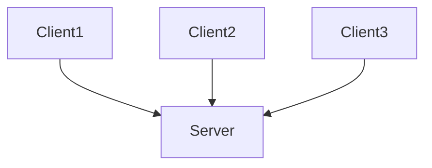
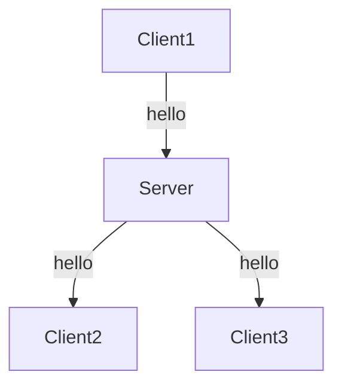
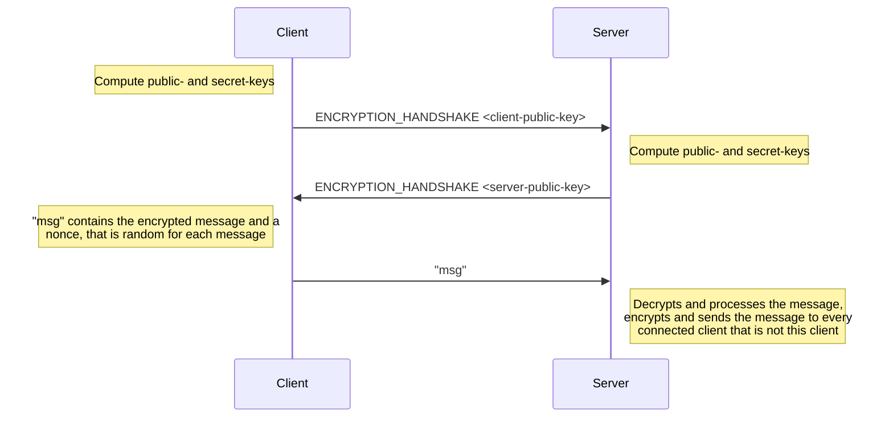

# The schwatz-protocol
## General
First of all, schwatz is using a client-server architecture.
The server is the master, every client connects to it.



A client sends a message to the server and the server broadcasts that message to every connected client, that is not the client which sent the message to the server.



By default, every message sent from the server to the client or from the client to the server is a normal text message that should be sent to every other client currently connected.
Internally, the client and server give each other commands. A command is structured like this:
```
/cmd <command_id> <message>
```
Using command_id to specify the command is actually kind of neat since it is easy to define an enum that gives labels to each command_id.
These are the command_id's that are currently available and their expected messages:
|label|id|message|
|--|--|--|
|ERROR|-1|An error message, ideally describing the error that occurred.|
|ENCRYPTION_HANDSHAKE|1|The message should contain the public-key each party has generated.|

View [client.md](https://github.com/tim-tm/schwatz/blob/main/docs/client.md) or [server.md](https://github.com/tim-tm/schwatz/blob/main/docs/server.md) for more implementation details.

## Encryption

Encrypting messages is important because we don't want any third-party to be able to read our messages.

Encryption in schwatz generally works like this:


